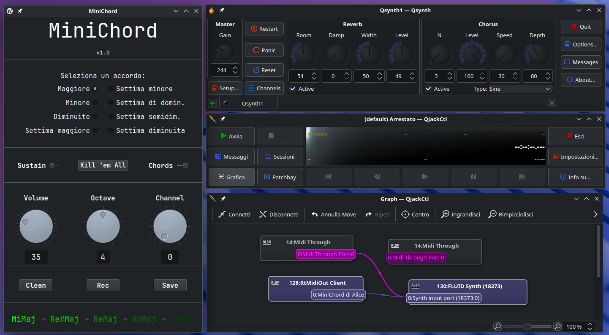

# MiniChord

(diverso da [questo](https://github.com/BenjaminPoilve/minichord), che è meraviglioso)

È una piccola app in Python che genera accordi o singole note a partire da un input da tastiera.

Di default, le 12 note della scala cromatica sono suonate con i tasti della seconda riga delle lettere della tastiera:

- Do &rarr; A
- Do# &rarr; S
- Re &rarr; D
- Re# &rarr; F
- ecc.

L'ho sviluppato e testato solo su Linux.

## Features

- 8 tipi di accordo: Maggiore, Minore, Diminuito, Settima Maggiore, Settima Minore, Settima di Dominante, Settima Semidiminuita, Settima Diminuita
- Estensione di 8 ottave
- 16 canali MIDI
- Modalità accordo oppure singola nota
- Sustain ON (la nota viene lasciata esaurire da sola) oppure OFF (la nota viene interrotta quando viene rilasciato il tasto)
- Bottone per spegnere tutti i segnali MIDI
- Visualizzazione delle ultime note/accordi suonati
- Salvataggio delle note/accordi suonati in un file di testo semplice con timestamps, per "registrare" una canzone
- Interfaccia disegnata in Qt6

## Scorciatoie di default:

- <kbd>+</kbd>/<kbd>-</kbd> &rarr; volume up/down
- <kbd>0</kbd>-<kbd>7</kbd> &rarr; cambia accordo
- <kbd>8</kbd>/<kbd>9</kbd> &rarr; ottava up/down
- <kbd>,</kbd>/<kbd>.</kbd> &rarr; canale up/down
- <kbd>Z</kbd> &rarr; sustain ON/OFF
- <kbd>X</kbd> &rarr; spegni tutte le note
- <kbd>C</kbd> &rarr; accordi ON/OFF
- <kbd>B</kbd> &rarr; pulisci lista note/accordi suonati
- <kbd>N</kbd> &rarr; registrazione ON/OFF
- <kbd>M</kbd> &rarr; salva lista note/accordi suonati

## Utilizzo

Su Linux, l'ho testato usando [QjackCtl](https://github.com/rncbc/qjackctl) e [Qsynth](https://github.com/rncbc/qsynth).

1. Avvio il MiniChord
2. Avvio Qsynth
3. Avvio QjackCtl e controllo il collegamento tra il MiniChord e Qsynth nel diagramma 



## Troubleshooting

Su Linux, sono necessari questi pacchetti:

```bash
# esempio di installazione per Debian e derivate
sudo apt install libxcb-cursor0 libqt6gui6
```